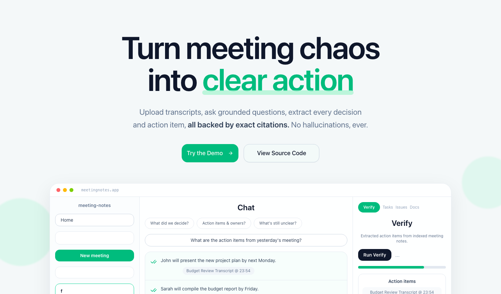
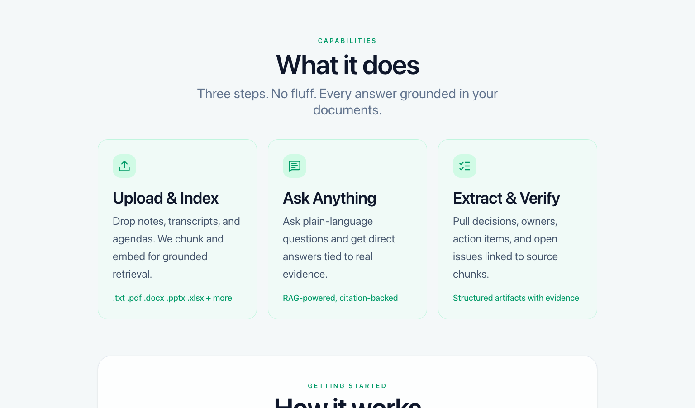
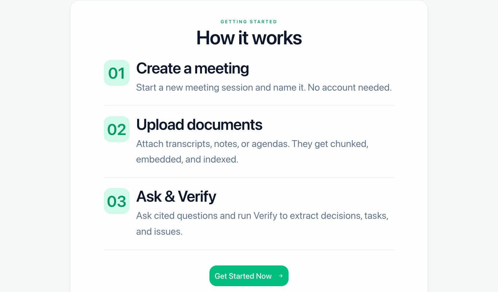
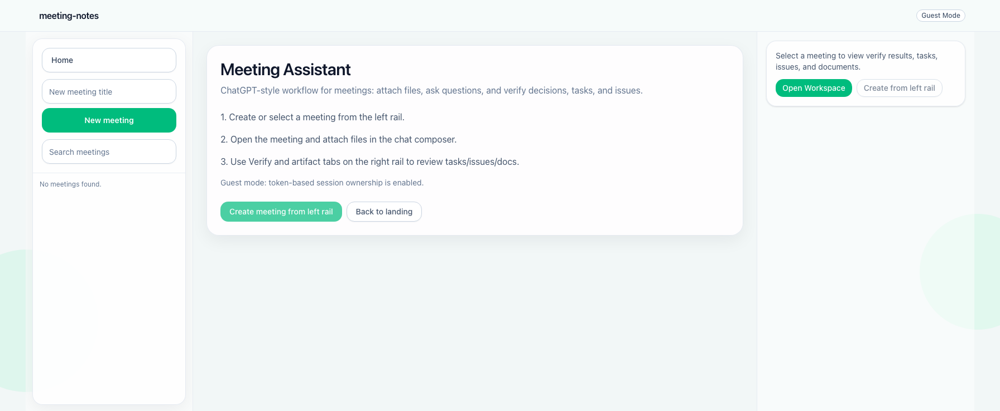
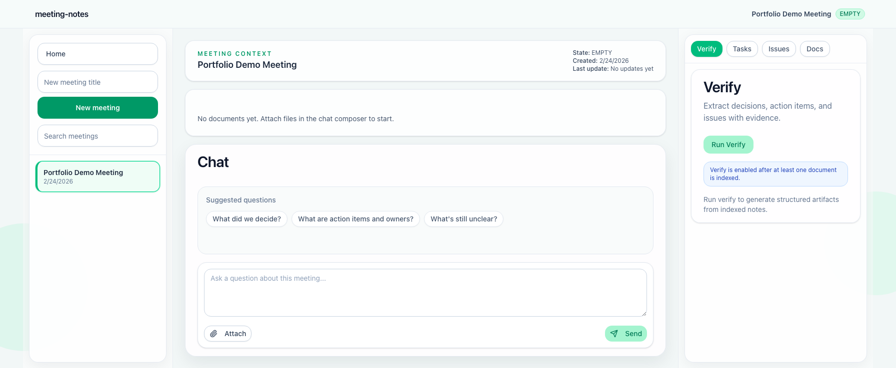

# meeting-notes

Meeting intelligence app with a FastAPI backend + Next.js frontend.

Live demo: `https://meetingnotes.xyz/`

## Why this project

`meeting-notes` turns long meeting documents into:
- grounded Q&A with citation-backed answers
- structured decisions, action items, and issues
- a persistent meeting workspace that survives refreshes

This project focuses on practical RAG reliability:
- deterministic citation generation
- strict verify output guardrails
- queue-based ingestion and indexing
- abuse controls (rate limits + quotas)

## Screenshots

### Landing: Hero



### Landing: Capabilities



### Landing: How It Works



### App: Workspace Home



### App: Meeting Workspace



Current capabilities:
- Guest session auth + meeting ownership scoping
- Meeting creation and listing
- File upload ingestion (single or multi-file)
- Background extraction + chunking + embeddings (RQ worker)
- Retrieval-augmented chat (RAG) with deterministic server-side citations
- Verify pipeline (decisions, actions, issues)
- Run-level observability for chat/verify
- Chat history API persisted in DB
- Chunk inspector API for evidence drawers
- Rate limits and daily quotas for expensive endpoints
- ChatGPT-style frontend shell with meetings rail, chat composer, and artifacts rail

## Repository Layout

```text
meeting-notes/
  apps/
    api/
      app/
        ai/                  # embeddings, chat grounding/citation logic
        db/                  # SQLAlchemy models/session/deps
        ingestion/           # text chunking
        jobs/                # indexing + stale processing reaper
        observability/       # run logging helpers
        processing/          # file type validation + extraction
        schemas/             # API request/response models
        verifier/            # verify engine
        main.py              # API routes + orchestration
        queue.py             # RQ enqueue helpers
        worker.py            # worker entrypoint
      alembic/
      tests/
    web/
      src/
        app/                 # Next App Router + route-group shell
        components/          # chat/docs/verify/shell components
        lib/                 # api client, query hooks, derived state
  backendap.md               # backend contract for frontend/agents
  frontend-plan.md           # frontend architecture + UX plan
```

## Backend Highlights

- Queue-backed indexing path:
  - `POST /meetings/{meeting_id}/documents` (text ingest)
  - `POST /meetings/{meeting_id}/documents/upload` (multipart file ingest)
- Guest auth path:
  - `POST /sessions/guest`
  - bearer token required for meeting/document/chat/verify/chunk routes
- Supported file types at upload validation:
  - PDF, DOCX, PPTX, XLSX, HTML, EML, TXT/MD, PNG/JPG/WEBP
- Upload guardrails:
  - MIME/extension allowlist
  - max upload size (`MAX_UPLOAD_BYTES`, default 25 MB)
- Worker processing:
  - extraction timeout (`EXTRACTION_TIMEOUT_SECONDS`)
  - max extracted text cap (`MAX_EXTRACTED_TEXT_CHARS`)
  - write new chunks first, clean previous chunks after commit
- Storage backends:
  - local (dev)
  - S3-compatible object storage (prod)
- Chat behavior:
  - DB-backed history (`GET /meetings/{id}/chat/history`)
  - deterministic server-side citation snippets from retrieved chunks
- Verify guardrails:
  - strict JSON schema output
  - evidence validation + deterministic issue rules
- Abuse controls:
  - per-IP + per-session per-minute rate limits
  - daily quotas for uploads/chats/verifies

## Frontend Highlights

- Desktop: 3-column app shell
  - left rail: meetings + create
  - center: chat thread + composer + attachments
  - right rail: verify/tasks/issues/docs
- Mobile:
  - meetings drawer + workspace tabs
- Polling:
  - poll meeting docs list while any doc is pending/processing
- UX polish:
  - loading states and transitions
  - chat history loaded from backend (survives refresh/device)

## Local Development

## 1) Start infra

```bash
cd meeting-notes
docker compose up -d db redis
```

## 2) Backend setup

```bash
cd apps/api
python3 -m venv .venv
./.venv/bin/pip install -r requirements.txt
set -a
source .env
set +a
./.venv/bin/alembic upgrade head
```

If your DB already had tables before Alembic:

```bash
./.venv/bin/alembic stamp head
```

## 3) Run backend API

```bash
cd apps/api
./.venv/bin/uvicorn app.main:app --host 127.0.0.1 --port 8000 --reload
```

## 4) Run worker (separate terminal)

```bash
cd apps/api
./scripts/run_worker_local.sh
```

Notes:
- On macOS, this script uses `rq.worker.SimpleWorker` by default to avoid Objective-C fork crashes.
- To force regular forking worker behavior: `RQ_WORKER_CLASS=rq.worker.Worker ./scripts/run_worker_local.sh`

## 5) Frontend setup + run

```bash
cd apps/web
npm install
npm run dev -- --port 3010
```

Open:
- Frontend: `http://localhost:3010`
- Backend docs: `http://127.0.0.1:8000/docs`

## End-to-End Smoke Check

```bash
API=http://127.0.0.1:8000
TOKEN=$(curl -s -X POST "$API/sessions/guest" | jq -r '.token')
AUTH="Authorization: Bearer $TOKEN"
MEETING_ID=$(curl -s -X POST "$API/meetings?title=Smoke" -H "$AUTH" | jq -r '.id')

curl -s -X POST "$API/meetings/$MEETING_ID/documents/upload" \
  -H "$AUTH" \
  -F 'doc_type=notes' \
  -F 'files=@/absolute/path/to/sample-upload.md'

curl -s "$API/meetings/$MEETING_ID/documents" -H "$AUTH"

curl -s -X POST "$API/meetings/$MEETING_ID/chat" \
  -H "$AUTH" \
  -H 'Content-Type: application/json' \
  -d '{"question":"What did we decide?"}'

curl -s "$API/meetings/$MEETING_ID/chat/history" -H "$AUTH"

curl -s -X POST "$API/meetings/$MEETING_ID/verify" -H "$AUTH"
```

## Documentation Map

- Backend contract: `backendap.md`
- Frontend architecture/UX plan: `frontend-plan.md`
- Alembic usage: `apps/api/alembic/README.md`
- Web app local run: `apps/web/README.md`
- Deployment/env profiles: `infra/deployment.md`
- Deploy + maintain + run-all guide: `infra/deploy-maintain-runbook.md`

## Notes

- Guest-mode auth/ownership is enabled; each token sees only its own meetings.
- OCR requires system OCR tooling (Tesseract/poppler) plus optional Python deps.
- CORS is configured for localhost/127.0.0.1 dev origins (port-flexible).
