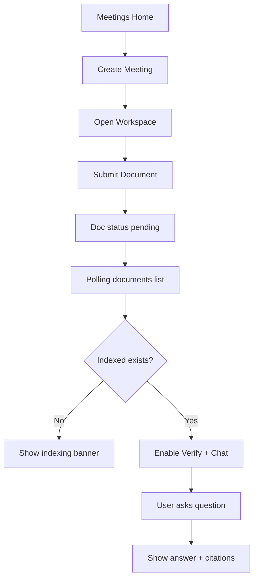
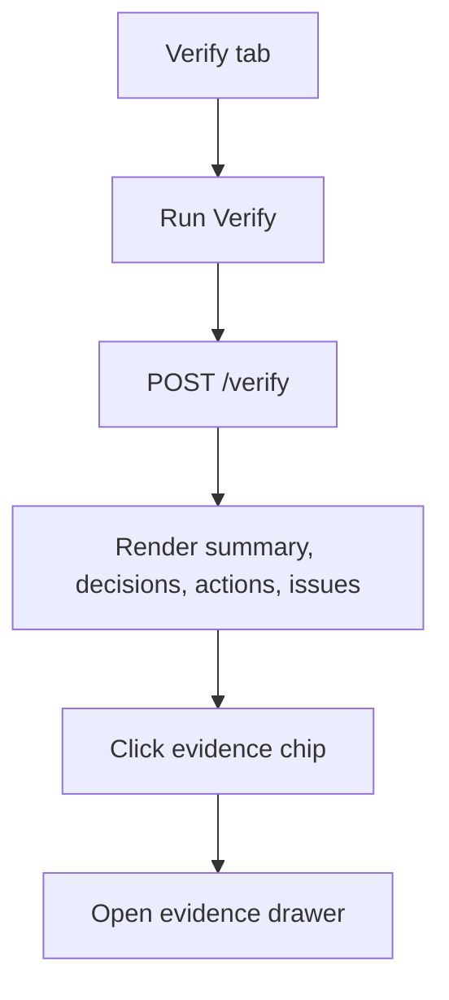

# Frontend Plan (UI/UX + Architecture)

This is the implementation plan for a new frontend app based on the current backend contract in `backendap.md`.

## 1) Product Goal

Build a meeting workspace where users can:
1. Create/select a meeting.
2. Ingest notes/transcripts.
3. Track indexing status clearly.
4. Run `Verify` for structured outputs and issues.
5. Ask `Chat` questions with citations.

## 2) Stack

- Next.js (TypeScript, App Router)
- Tailwind CSS
- shadcn/ui
- TanStack Query
- react-hook-form + zod
- react-markdown
- lucide-react

## 3) UX Principles

- Show system state explicitly (indexing, partial, failed, ready).
- Never hide uncertainty (`I don't know`, no citations, indexing in progress).
- Keep primary actions always visible (ingest, verify, ask).
- Optimize for one-meeting workspace flow.
- Mobile-first fallback via tabs.

## 4) Information Architecture

- `/` -> Meetings Home
- `/meetings/[meetingId]` -> Meeting Workspace

Workspace sections (tabs on mobile, 2-column on desktop):
- Documents
- Verify
- Chat

## 5) Derived Meeting Readiness (Single Source of Truth)

Create `lib/state/meetingIndexState.ts`:

```ts
export type MeetingIndexState =
  | "EMPTY"
  | "NOT_INDEXED"
  | "PARTIALLY_INDEXED"
  | "INDEXED"
  | "FAILED_ONLY";
```

Derive state from `GET /meetings/{meeting_id}/documents`:
- `EMPTY`: no documents
- `NOT_INDEXED`: 0 indexed, at least one pending/processing
- `PARTIALLY_INDEXED`: >=1 indexed and >=1 pending/processing
- `INDEXED`: >=1 indexed and 0 pending/processing
- `FAILED_ONLY`: 0 indexed, >=1 failed, 0 pending/processing

UI behavior from state:
- Verify button enabled for `PARTIALLY_INDEXED` and `INDEXED`
- Chat input disabled only for `NOT_INDEXED`
- Show status banner for `NOT_INDEXED` and `PARTIALLY_INDEXED`
- Show recovery CTA for `FAILED_ONLY`

## 6) Page Plans

## 6.1 Meetings Home (`/`)

Purpose: create and open meetings.

Components:
- `TopNav`
- `CreateMeetingDialog`
- `MeetingsList`
- `MeetingCard`
- `EmptyState`

UX details:
- Quick client-side search on title.
- Empty state CTA: `Create your first meeting`.
- Newest meetings first.

## 6.2 Meeting Workspace (`/meetings/[meetingId]`)

Header:
- Meeting title
- Global status pill (from `MeetingIndexState`)
- Last indexed timestamp (max `indexed_at` across docs)

Desktop layout:
- Left: Documents + Verify
- Right: Chat

Mobile layout:
- Tabs: `Documents`, `Verify`, `Chat`

### Documents section

Components:
- `DocumentUploadForm` (always visible)
- `DocumentsTable`
- `DocumentStatusBadge`
- `ReindexButton`
- `IndexingBanner`

Fields:
- `doc_type`, `filename`, `text`

Row actions:
- Reindex (when not processing)
- Copy document id
- Show error tooltip and copy error for failed docs

### Verify section

Components:
- `VerifyPanel`
- `SummaryCard`
- `DecisionsList`
- `ActionItemsTable`
- `IssuesBoard`
- `EvidenceDrawer`

Structure:
- Collapsible groups:
  - Summary & Decisions
  - Action Items
  - Issues

Rules:
- `Run Verify` disabled for `EMPTY`, `NOT_INDEXED`, `FAILED_ONLY`
- Show "last verified" timestamp (from query cache now; runs API later)
- Keep previous verify result visible until refresh completes

### Chat section

Components:
- `ChatPanel`
- `MessageList`
- `MessageBubble`
- `CitationChips`
- `CitationDrawer`
- `NoEvidenceCallout`

UX details:
- Suggested question chips before first message:
  - `What did we decide?`
  - `What are action items and owners?`
  - `What's still unclear?`
- If response has empty citations, show `NoEvidenceCallout`
- Distinguish assistant states: grounded, unknown, indexing

## 7) Data Layer Plan

## 7.1 API Client

Create `lib/api/client.ts`:
- shared `fetchJson` wrapper
- normalized error extraction (`detail` handling)
- env base URL: `NEXT_PUBLIC_API_BASE_URL`

## 7.2 React Query Hooks

`lib/queries/meetings.ts`
- `useMeetings()` -> `GET /meetings`
- `useCreateMeeting()` -> `POST /meetings`

`lib/queries/documents.ts`
- `useMeetingDocuments(meetingId)` -> `GET /meetings/{meetingId}/documents`
- `useCreateDocument(meetingId)` -> `POST /meetings/{meetingId}/documents`
- `useReindexDocument()` -> `POST /documents/{document_id}/reindex`

`lib/queries/verify.ts`
- `useVerifyMeeting(meetingId)` -> `POST /meetings/{meetingId}/verify`

`lib/queries/chat.ts`
- `useChat(meetingId)` -> `POST /meetings/{meetingId}/chat`

## 7.3 Polling Strategy

Use one poll source per workspace:
- Poll `GET /meetings/{meeting_id}/documents` every 2s while any doc is `pending/processing`
- Stop polling when all docs are terminal (`indexed/failed`)

This avoids per-document polling complexity.

## 8) Component/Folder Structure

```txt
apps/web/
  src/
    app/
      layout.tsx
      providers.tsx
      page.tsx
      meetings/
        [meetingId]/
          page.tsx
    components/
      layout/
        AppShell.tsx
        TopNav.tsx
      meetings/
        CreateMeetingDialog.tsx
        MeetingsList.tsx
        MeetingCard.tsx
      documents/
        DocumentUploadForm.tsx
        DocumentsTable.tsx
        DocumentStatusBadge.tsx
        IndexingBanner.tsx
        ReindexButton.tsx
      verify/
        VerifyPanel.tsx
        SummaryCard.tsx
        DecisionsList.tsx
        ActionItemsTable.tsx
        IssuesBoard.tsx
        EvidenceDrawer.tsx
      chat/
        ChatPanel.tsx
        MessageList.tsx
        MessageBubble.tsx
        CitationChips.tsx
        CitationDrawer.tsx
        NoEvidenceCallout.tsx
      shared/
        ApiErrorBanner.tsx
        EmptyState.tsx
        SkeletonBlock.tsx
    lib/
      api/
        client.ts
        errors.ts
      queries/
        meetings.ts
        documents.ts
        verify.ts
        chat.ts
      state/
        meetingIndexState.ts
      schemas/
        meetings.ts
        documents.ts
        verify.ts
        chat.ts
      utils/
        time.ts
        text.ts
```

## 9) End-to-End UX Flows

## 9.1 Create + Ingest + Ask



## 9.2 Verify Flow



## 10) Wireframe Preview (Low Fidelity)

Desktop:

```txt
+--------------------------------------------------------------------------------+
| TopNav | Meeting: Q1 Planning | Status: PARTIALLY_INDEXED | Last indexed: ... |
+-------------------------------------------+------------------------------------+
| Documents                                  | Chat                               |
| [doc_type] [filename]                      | [message list...]                  |
| [textarea notes...] [Upload & Index]       |                                    |
|-------------------------------------------  | [question input........] [Send]    |
| docs table (status, error, reindex)        | citations chips under each answer  |
|-------------------------------------------  |                                    |
| Verify                                     |                                    |
| [Run Verify]                               |                                    |
| Summary/Decisions (collapse)               |                                    |
| Action Items (collapse)                    |                                    |
| Issues (collapse)                          |                                    |
+-------------------------------------------+------------------------------------+
```

Mobile:

```txt
[TopNav]
[Meeting title + status]
[TABS: Documents | Verify | Chat]
(active tab content)
```

## 11) Error and Edge-State Design

- API error (`detail`) -> toast + inline `ApiErrorBanner`
- Queue enqueue failure -> failed badge + error text
- No citations -> `NoEvidenceCallout` (non-blocking warning)
- Verify while not indexed -> disabled CTA with helper text
- `FAILED_ONLY` state -> prominent `Retry indexing` guidance
- Add `Demo mode` label (no auth yet)

## 12) Accessibility + Interaction Requirements

- Keyboard navigable dialogs/sheets/tabs (shadcn defaults)
- Visible focus rings
- Status badges with text (not color alone)
- `aria-live="polite"` for indexing status updates
- Hit-target size >= 40px for mobile actions

## 13) Phased Build Plan

Phase 1: App skeleton + providers
- Next.js app scaffold
- Tailwind + shadcn setup
- React Query provider and toaster

Phase 2: Meetings Home
- list meetings
- create meeting dialog
- empty/search states

Phase 3: Documents pipeline UX
- upload form + docs table
- polling + derived meeting state
- reindex button + failure UX

Phase 4: Verify UX
- run verify
- collapsible output sections
- evidence drawer

Phase 5: Chat UX
- chat composer + streamless responses
- citations chips/drawer
- suggested questions + no-evidence callout

Phase 6: Polish
- responsive refinements
- skeletons + error handling consistency
- basic telemetry hooks (optional)

## 14) Done Criteria

- User can complete full workflow from meeting creation to grounded answer.
- Indexing state is consistent across header/banner/buttons.
- Verify output is readable and actionable on desktop and mobile.
- Chat always communicates evidence quality (citations vs no citations).
- No endpoint assumptions beyond current backend contract.
